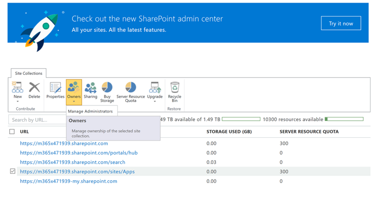

# Visualizzazione o aggiunta di un amministratore al catalogo app di SharePoint Online

Per installare correttamente CLO365, è necessario che la persona che effettua il provisioning della soluzione venga elencata come amministratore del catalogo app tenant.

1. Dal portale di amministrazione di Office 365 passare all'interfaccia di gestione di SharePoint Online
1. **Selezionare** l'URL del catalogo app dall'elenco 
1. Verificare che il programma di installazione di CLO365 sia elencato come uno degli amministratori del catalogo app.

Se il nome utente è elencato, è possibile tornare al provisioning del sito di apprendimento personalizzato.  Se non vengono completati i passaggi successivi. 

## Aggiungere un amministratore

1. Nell'interfaccia di amministrazione di SharePoint selezionare la casella di controllo accanto all'URL del catalogo app e selezionare la casella di controllo proprietari.

1. Selezionare Gestisci amministratori dal menu 
1. Aggiungere l'utente corretto come amministratore della raccolta siti e fare clic su OK per salvare le modifiche.

### Passaggi successivi-provisioning del [sito](installsitepackage.md)
