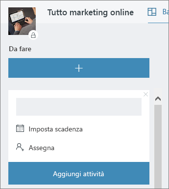

# Riunioni in ufficio

È 10:00 AM e l'ora per la riunione. In questa sezione viene illustrato rendere più produttivi le riunioni.  Comporta la procedure consigliate per la preparazione della riunione e gli strumenti di Office 365.  

## Strumenti
- Outlook
- Microsoft Teams
- Skype for Business
- OneNote

## Elenco di controllo per la riunione
- Pianificazione e le riunioni
- Partecipare a una riunione
- Informazioni presenti in una riunione
- Utilizzare per la creazione condivisa e note di OneNote in una riunione
- Pianificazione di utilizzo in una riunione per tenere traccia delle attività per progetto
- Terminare una riunione
 
## Pianificazione e le riunioni
Esistono alcune operazioni da eseguire per garantire che la riunione è il livello di produttività possibile:

1. **Necessità di una riunione?** Prendere in considerazione la condivisione di un file in chat con i revisori necessari prima.  
1. **Avere una chiara agenda.**  Includere la agenda riunione nella sezione Note dell'invito alla riunione online in modo che i partecipanti possono essere preparati.
1. **Record alla riunione**  Utilizzare le funzioni di registrazione delle riunioni in Teams Microsoft per condividere la riunione con persone che non è possono partecipare o trascrivere note sulla versione successiva.  

A questo punto si è pronti per tale riunione del libro: libro alla riunione con Microsoft Teams o in dettaglio le Skype for Business in Outlook. Pur pertanto consente di includere i membri del team da posizioni diverse, registrare la riunione e utilizzare video (se disponibili) per migliorare la comunicazione. 

## Partecipare a una riunione
Partecipare da qualsiasi posizione. È possibile partecipare a una Teams Microsoft o Skype per le riunioni aziendali da qualsiasi posizione tramite un dispositivo mobile, è possibile chiamare il numero di accesso nei dettagli della riunione o utilizzando applicazioni per dispositivi mobili. Quando si utilizzano le applicazioni per dispositivi mobili, tenere conto dei limiti di utilizzo di dati per dispositivi mobili che si applicano all'utente o il proprio paese.

> [!TIP]
> **Utilizzare un auricolare.** Se ci si connette dal computer dell'utente alla scrivania, utilizzare un auricolare anziché microfono del computer in uso e gli altoparlanti per garantire una migliore qualità delle chiamate.

> [!TIP]
> Attivare la funzionalità video! Quando fotocamere sono disponibile, è opportuno utilizzarle, durante la comunicazione faccia a faccia fornisce non verbali che possono essere perse quando si utilizza solo VoIP. Non bisogna preoccuparsi, i fini accattivante. 

## Informazioni presenti in una riunione
Condivisione di contenuto da un dispositivo è un modo straordinario per lo stato attivo alla riunione e forniscono il contesto alla discussione. In generale, condivisione dello schermo intero può essere una buona idea. Significa che tutto ciò che viene visualizzata sullo schermo verrà visualizzato nella schermata di tutti i partecipanti alla riunione. Evitare questo problema selezionando semplicemente il contenuto che si desidera condividere Microsoft Teams. 

## Utilizzare OneNote in una riunione
OneNote può consentire per la collaborazione in tempo reale e la creazione condivisa, rendendo strumento ideale per brainstorming e prendere nota taking nelle riunioni. Purché chiunque abbia accesso al percorso in cui è condivisa di OneNote, è possibile inserire un collegamento nel blocco note e avviare immediatamente brainstorming.

È possibile creare una sezione specifica per Lotus notes nel blocco appunti team delle riunioni. Inoltre, è possibile utilizzare la funzionalità "dettagli sulla riunione" in OneNote per creare pagine con un riepilogo dei dettagli della riunione.

## Utilizzare pianificazione in una riunione
Aggiungere direttamente le azioni in un piano per il progetto evita la trascrizione li dopo aver fatto. È consigliabile nelle riunioni di progetto di grandi dimensioni per assegnare una persona all'azione prendere appunti & di verifica. In genere si tratta di un utente diverso rispetto a singoli che esegue la riunione. Promemoria azione vengono inviati direttamente ai singoli a cui è assegnato come sono promemoria se l'elemento passa la data di scadenza. 

## Terminare una riunione
Quando tutti gli elementi in agenda trattati, terminare la riunione, indipendentemente dal momento. Assegnare e inviare le azioni a tutti i partecipanti. Se si collabora Teams Microsoft, è possibile condividere facilmente le attività nel canale appropriato. Le azioni possono anche essere immesso e assegnate nella visualizzazione pianificazione durante la riunione, che fornisce un modo rapido per tenere traccia per il completamento che può essere [vi si accede nel team di Microsoft](https://support.office.com/en-us/article/use-planner-in-microsoft-teams-62798a9f-e8f7-4722-a700-27dd28a06ee0). 