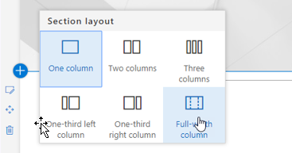

# Installazione della soluzione di apprendimento personalizzata WebPart

## Prerequisiti per un'installazione a livello di tenant

- Per installare il WebPart di apprendimento personalizzato per l'intero tenant, sarà necessario disporre delle autorizzazioni amministrative di Office 365.  Se non si dispone di queste autorizzazioni, è possibile collaborare con l'amministratore di Office 365 o installare WebPart per una singola raccolta siti.
- L'utente o l'amministratore di Office 365 deve disporre di un programma di installazione e configurazione di un [Catalogo](https://docs.microsoft.com/en-us/sharepoint/dev/spfx/set-up-your-developer-tenant) app a livello di tenant o di una [raccolta siti](https://docs.microsoft.com/en-us/sharepoint/dev/general-development/site-collection-app-catalog)per la ricezione del controllo WebPart.
- Il supporto di SharePoint Online è solo. La Web part non è supportata per l'installazione in qualsiasi versione di SharePoint in locale.

## Aggiungere il WebPart di apprendimento personalizzato al tenant 

1. Scaricare il WebPart di apprendimento personalizzato e salvarlo nell'unità locale.  Questo file è denominato "MS-Custom-Learning. sppkg".  Non modificare il nome o il suffisso del file. 
2. Accedere al [portale di amministrazione di Office 365](https://admin.microsoft.com/AdminPortal/Home#/homepage) per il tenant
3. Dal riquadro di spostamento sinistro selezionare interfaccia di amministrazione di SharePoint. Verrà aperto in una nuova scheda., nell'interfaccia di amministrazione di SharePoint selezionare app, Catalogo app, app per SharePoint 
4. Selezionare carica il WebPart e scegliere il file "MS-Custom-Learning. sppkg" Scaricato
5. Per questa installazione a livello di tenant, selezionare la casella accanto a "rendere disponibile la soluzione a tutti gli alloggi nell'organizzazione".  
 
> [!NOTE]
> Dopo aver installato il controllo WebPart, sarà possibile trovarlo nella raccolta WebPart in SharePoint Online.  **Nella raccolta il controllo WebPart è denominato "Microsoft Learning"**

## Aggiungere la Microsoft Learning WebPart a una pagina di SharePoint Online

Dopo aver installato l'apprendimento personalizzato nel tenant, è possibile aggiungere la Web part a una pagina di SharePoint. Quando si esegue Office 365 e la formazione di Windows 10 è disponibile per il sito.

1. Aggiungere il controllo WebPart di apprendimento personalizzato in un layout di colonna a larghezza intera:

2. Nella pagina di SharePoint, selezionare Aggiungi sezione e quindi colonna larghezza intera.  Verrà visualizzato il seguente messaggio di richiesta:

3. Selezionare Microsoft Learning.  È ora necessario vedere quanto segue: 

 È ora possibile fare clic sui riquadri per esplorare il contenuto predefinito incluso nella soluzione.  

### Passaggi successivi
- Esaminare il [contenuto predefinito](webpartcontent.md) incluso in WebPart.
- [Personalizzare](customization.md) l'esperienza di formazione per l'organizzazione.
- [Guidare l'adozione](driveadoption.md) della soluzione di formazione.

